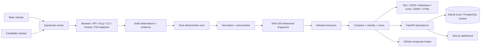

# ReleaseTruth

> Git shows what code changed. ReleaseTruth shows what your product actually changed.

[](https://github.com/PSR94/ReleaseTruth/actions/workflows/ci.yml)
[](LICENSE)
[](docs/concepts/behavior-lock.md)

ReleaseTruth is an open-source, evidence-first behavioral compatibility engine for application releases. It captures what users and integrations can actually observe, normalizes volatile noise, fingerprints the result into a versioned `behavior.lock.json`, compares releases deterministically, classifies regressions, scores compatibility, and emits CI- and human-friendly reports.

ReleaseTruth complements code diffs, API-schema diffs, visual regression tools, and contract tests. Its unit of truth is **observable runtime behavior across surfaces**. AI is optional and downstream; deterministic evidence remains the source of truth.

---

## Project handoff — read this first next time

**Handoff date:** September 9, 2026 (America/New_York)  
**Repository:** `PSR94/ReleaseTruth`  
**Default branch:** `main`  
**Last fully validated implementation commit before this README-only handoff update:** `480bbc638c2e0f6e576d6b47a6cf3303a0d241f4`  
**Authoritative validation:** GitHub Actions CI run **#47** completed successfully on that implementation commit.  
**Current product version in source:** `0.1.0`  
**Published GitHub Release:** **none yet**  
**Open non-main branch:** `dependabot/cargo/sha2-0.11`  
**Open PR:** **#2 — `chore(deps): bump sha2 from 0.10.9 to 0.11.0`**

### Current status in one sentence

The **v0.1 implementation is complete and end-to-end validated**, including the deterministic Rust core, CLI, all six runtime adapters, TruthShop regression target, FastAPI persistence, PostgreSQL migrations, Next.js dashboard, Docker Compose stack, composite GitHub Action, report formats, and full capture-to-dashboard E2E; **release publication and repository hardening/next-version work remain pending and are intentionally listed below rather than being silently treated as done**.

### What was completed so far

The work completed up to this handoff includes:

- built the Rust deterministic behavioral model and comparison engine;
- implemented conservative normalization, recursive canonicalization, stable behavioral fingerprints, stable change IDs, deterministic classification, expected-change handling, and weighted scoring;
- defined `behavior.lock.json` v1 plus JSON schemas and a migration boundary;
- implemented the `releasetruth` CLI with `init`, `doctor`, `capture`, `compare`, `fingerprint`, `baseline`, `history`, `blame`, and `bisect`;
- implemented text, JSON, Markdown, JUnit, SARIF, and standalone HTML comparison reports;
- implemented six real TypeScript capture surfaces: API, browser, accessibility, CLI, events/webhooks, and performance;
- added deterministic adapter tests and fixed workspace/runtime type/export issues discovered by CI;
- built the TruthShop demo with a known-good release and an intentional regression release;
- encoded flagship regressions across all six surfaces and assert them in E2E;
- built a YAML-driven capture runner and demo configuration;
- built FastAPI persistence for projects, snapshots, runs, changes, baselines, summary data, and GitHub deliveries;
- added SQLite zero-setup local mode and PostgreSQL deployment mode;
- added Alembic migrations and a CI upgrade → downgrade → upgrade migration smoke test;
- hardened GitHub webhook ingestion so it is disabled by default, requires HMAC verification when enabled for production, and handles duplicate delivery IDs idempotently;
- built a Next.js dashboard for project timelines, compatibility scores, baseline context, and before/after change exploration;
- fixed the dashboard/API zero-score bug so a legitimate `0.0` compatibility average remains `0.0` instead of being replaced by a fallback `100.0`;
- added an E2E assertion that the dashboard overview renders the persisted score correctly;
- added Dockerfiles and Docker Compose for PostgreSQL, API, dashboard, TruthShop good, and TruthShop regression services;
- added a composite GitHub Action that compares behavior locks, writes reports, emits outputs, and gates on configured severity;
- added composite Action smoke coverage in CI;
- added a full CI matrix for Rust, TypeScript/Next.js, FastAPI, PostgreSQL migrations, containers, the composite Action, and behavioral E2E;
- fixed Playwright/Chromium installation so browser capture works from the correct workspace;
- added deterministic replay verification: re-finalizing identical normalized behavior must reproduce the same fingerprint;
- added E2E evidence upload including hidden `.releasetruth` content;
- added real dashboard screenshot capture to E2E evidence;
- added cross-platform tag release automation for Linux, macOS, and Windows CLI archives plus SHA-256 checksums;
- added project architecture, API, CLI, deployment, GitHub Actions, security/trust-model, testing, prior-art, release-checklist, changelog, roadmap, and brand documentation;
- replaced the original placeholder README with a product-level guide and this durable project handoff.

### Last validated end-to-end behavior

The final validated implementation checkpoint proved the complete path:

```text
TruthShop good + regression targets
        ↓
TypeScript runner + six adapters
        ↓
draft observations + evidence
        ↓
Rust normalization + canonicalization
        ↓
behavior.lock.json + SHA-256 fingerprint
        ↓
deterministic compare + classify + score
        ↓
text / JSON / Markdown / JUnit / SARIF / HTML reports
        ↓
FastAPI persistence + SQLite/PostgreSQL
        ↓
Next.js dashboard
        ↓
real dashboard screenshots + CI evidence artifact
```

The E2E specifically asserts these flagship regressions:

| Surface | Expected regression | Expected classification |
| --- | --- | --- |
| API | invalid order HTTP status `400 → 422` | breaking |
| Browser | destructive checkout confirmation removed | breaking |
| Accessibility | Pay control `button → generic` | breaking |
| Accessibility | Pay control loses keyboard focusability | breaking |
| CLI | receipt command exit `0 → 1` | breaking |
| Events | checkout webhook order reversed | significant |
| Performance | search p95 increases beyond configured 50% threshold | significant |

It also verifies that every one of the six surfaces produces real observations, reports are non-empty and structurally valid, comparison data persists through the API, the dashboard renders representative changes, and identical base behavior re-finalizes to the same fingerprint.

### Next-session starting instructions

**Do not start by re-reading the entire repository.** Start here:

1. Read this **Project handoff** section and the **TODO / pending work** section below.
2. Check `main` HEAD and the latest CI result because this README update itself triggers a docs-only CI run.
3. Check PR **#2** and the Dependabot branch before release work.
4. Work the TODO list from **P0 → P1 → P2**.
5. Only re-audit already completed subsystems when a current test, CI failure, security concern, or dependency change gives a concrete reason.

Suggested next-session instruction:

```text
@GitHub Open PSR94/ReleaseTruth. Read the root README Project handoff and TODO sections first. Continue from the highest-priority unchecked TODO item. Do not re-audit completed areas unless current CI or the dependency update exposes a failure.
```

---

## TODO / pending work

This is the authoritative continuation list as of **September 9, 2026**. Items here are intentionally **not** claimed as complete.

### P0 — finish v0.1 release/publication

- [ ] **Confirm the CI run triggered by this README-only handoff commit is green.** The underlying implementation was already fully green in CI run #47 at `480bbc638c2e0f6e576d6b47a6cf3303a0d241f4`, but the release should still be tagged from an exact green HEAD that contains final docs.
- [ ] **Review Dependabot PR #2 (`sha2 0.10.9 → 0.11.0`).** Either merge it after confirming compatibility and full CI, or close/defer it. Do not silently publish while an intended dependency update is unresolved.
- [ ] **If PR #2 is merged, rerun the entire required CI/E2E matrix and release only from that new green commit.**
- [ ] **Configure branch protection/rulesets for `main`.** At this handoff GitHub reports `main` as unprotected. Require the important CI checks before merge/push according to the desired repository policy.
- [ ] **Publish the first `v0.1.0` GitHub Release only after the exact final HEAD is green.** There is currently no published GitHub Release.
- [ ] **Validate the tag workflow on the real `v0.1.0` tag.** Confirm Linux, macOS, and Windows CLI archives are created and their SHA-256 checksum files are correct.
- [ ] **Confirm the release notes/changelog match the tagged commit** and do not describe unshipped roadmap functionality.
- [ ] **Verify GitHub repository metadata before public launch:** description, topics, homepage/project URL if desired, and the displayed license metadata. The repository contains an Apache-2.0 `LICENSE`, but GitHub repository metadata should be checked to ensure it is recognized as intended.
- [ ] **Decide whether container images should also be published to a registry.** Current Docker support builds/runs locally and in CI; registry publication is not part of the current v0.1 release path.
- [ ] **Decide whether the Rust CLI should be published to crates.io and whether JavaScript packages should be published.** Current supported path is source build/install plus GitHub release archives; package-registry publication is not yet documented as completed.
- [ ] **Perform one final human README-link/release-artifact check after tagging.** Automation verifies runtime behavior; public release presentation still benefits from a brief manual sign-off.

### P1 — v0.2 candidates

- [ ] Native GitHub App installation/onboarding instead of only the current composite Action + webhook endpoint.
- [ ] Richer pull-request annotations and review UX.
- [ ] Remote evidence/object storage with retention controls rather than keeping all evidence in local/CI filesystem paths.
- [ ] Authenticated multi-user projects, authorization boundaries, session management, and production deployment hardening.
- [ ] Richer source/commit correlation and behavioral coverage analytics.
- [ ] Adapter SDK and a supported external adapter/plugin lifecycle.
- [ ] GraphQL behavioral adapter.
- [ ] gRPC behavioral adapter.
- [ ] Database behavioral adapter.
- [ ] Distributed capture workers for stronger isolation and scalable browser/CLI execution.
- [ ] Improve release/history correlation across branches, pull requests, and deployment environments.
- [ ] Add configurable evidence retention/deletion policies and storage quotas.
- [ ] Add production observability for the API/dashboard stack: structured logs, metrics, health/readiness details, and alerting guidance.
- [ ] Add explicit API authentication/rate-limit guidance before exposing the service to the public internet.
- [ ] Add backup/restore and migration rollback operational documentation for hosted PostgreSQL deployments.
- [ ] Add more fixtures for large behavior locks, pathological nested diffs, performance-noise boundaries, and migration compatibility.
- [ ] Add additional browser/runtime matrix coverage when needed (for example Firefox/WebKit), while keeping deterministic semantics stable.
- [ ] Decide whether screenshot evidence should remain evidence-only or gain a dedicated visual/pixel-diff compatibility surface. ReleaseTruth v0.1 is not a general-purpose pixel-diff engine.

### P2 — later roadmap

- [ ] GitLab integration and additional CI-provider integrations.
- [ ] Mobile/device behavioral surfaces.
- [ ] Hosted execution/control plane.
- [ ] Adapter marketplace/discovery.
- [ ] Optional AI explanation providers that remain downstream of deterministic evidence and never determine the compatibility verdict.
- [ ] Additional hosted collaboration workflows after authentication, storage, isolation, and operational hardening are mature.

### Known boundaries to remember before future work

- The deterministic engine is the verdict source; do not make AI-generated interpretation part of fingerprinting, classification, or pass/fail behavior.
- Ordered arrays remain ordered unless configuration explicitly says they are semantically unordered.
- Default normalization removes known volatile data conservatively; it must not erase meaningful host/behavior differences simply to make tests pass.
- Browser screenshots are captured as evidence, not currently treated as a standalone pixel-diff engine.
- Performance evidence is environment-sensitive; thresholds and controlled runners matter.
- API/browser adapters redact fields they know are sensitive, but capture configuration and new adapters still require security review.
- CLI execution uses `shell: false` by default and temporary directories, but ReleaseTruth is **not** a secure sandbox for hostile binaries/configurations.
- The API has no completed production multi-user authentication layer yet; use trusted-network/reverse-proxy controls if deploying beyond local/internal environments.
- GitHub webhook ingestion is disabled by default and should require a secret when enabled outside explicit dev mode.
- SQLite is the zero-setup local/demo path; PostgreSQL + Alembic is the intended composed/hosted persistence path.
- `behavior.lock` schema v1 is the current contract. Future schema versions should use explicit migration logic instead of silently changing v1 semantics.

---

## Table of contents

- [Project handoff — read this first next time](#project-handoff--read-this-first-next-time)
- [TODO / pending work](#todo--pending-work)
- [What ReleaseTruth detects](#what-releasetruth-detects)
- [Architecture](#architecture)
- [Quick start](#quick-start)
- [CLI](#cli)
- [`behavior.lock.json`](#behaviorlockjson)
- [Configuration](#configuration)
- [Reports and exit codes](#reports-and-exit-codes)
- [GitHub Actions](#github-actions)
- [API and dashboard](#api-and-dashboard)
- [Self-hosting](#self-hosting)
- [Determinism and trust model](#determinism-and-trust-model)
- [Validation matrix](#validation-matrix)
- [Repository map](#repository-map)
- [Design principles](#design-principles)
- [Prior art and scope](#prior-art-and-scope)
- [Development](#development)
- [Release status](#release-status)
- [Documentation index](#documentation-index)
- [License](#license)

## What ReleaseTruth detects

| Surface | Examples of captured behavior | Flagship TruthShop regression |
| --- | --- | --- |
| API | status, selected headers, body, timing, cookies | invalid order `400 → 422` |
| Browser | journeys, visible text, DOM signals, dialogs, storage, network, focus | destructive confirmation removed |
| Accessibility | roles, names, focusability, axe violations | Pay control `button → generic` and loses keyboard focusability |
| CLI | argv execution, exit code, stdout/stderr, filesystem snapshot | receipt command exit `0 → 1` |
| Events | webhook/event sequence and stable headers | event order reversed |
| Performance | repeated timings, min/max/mean/p50/p95 | search p95 regresses beyond configured 50% threshold |

The included TruthShop demo intentionally introduces all six classes of regression so the full pipeline can prove that capture, normalization, diffing, persistence, dashboard rendering, and CI reporting work together.

## Architecture



### Component responsibilities

| Component | Responsibility |
| --- | --- |
| `crates/core` | deterministic model, normalization, canonicalization, fingerprinting, diffing, classification, acceptance, scoring, migration boundary |
| `crates/cli` | project initialization, capture finalization, comparison/reporting, fingerprint verification, baseline/history/blame/bisect |
| `packages/runner` | YAML-driven orchestration of runtime capture scenarios |
| `adapters/api` | HTTP request/response/timing/cookie evidence with redaction |
| `adapters/browser` | Playwright journeys, visible text, DOM signals, network, dialogs, storage, focus, screenshots |
| `adapters/accessibility` | semantic controls/headings/focusability plus axe-based accessibility evidence |
| `adapters/cli` | process exit/stdout/stderr/filesystem behavior using `shell: false` by default |
| `adapters/events` | loopback webhook/event collection and stable sequence evidence |
| `adapters/performance` | repeated timing samples and summary metrics including p50/p95 |
| `apps/demo-shop` | TruthShop proof target with good/regression runtime variants |
| `apps/api` | persistence, history, baselines, summary API, GitHub delivery ingestion |
| `apps/dashboard` | human exploration of compatibility history and changes |
| `action.yml` | reusable GitHub composite comparison/report/gating action |
| `docker-compose.yml` | local/self-hosted full stack |

The Rust core owns deterministic finalization and comparison. TypeScript adapters collect runtime evidence. The FastAPI service and Next.js dashboard persist and explore history without changing comparison semantics.

See [System architecture](docs/architecture/system.md) and the [architecture decisions](docs/architecture/decisions/).

## Quick start

### Prerequisites

- Rust **1.98.1** via `rustup` (the repository pins it in `rust-toolchain.toml`)
- Node.js **20+**; CI uses Node 22
- pnpm **9.15.4** via Corepack or pnpm
- Python **3.12+** for the API/platform
- Chromium for browser capture
- Docker + Docker Compose for the full self-hosted stack/release check

Install repository dependencies and Chromium:

```bash
make setup
```

### Run the complete behavioral demo

```bash
make demo
```

This builds ReleaseTruth and TruthShop, starts a good release on `127.0.0.1:3000` and a regression release on `127.0.0.1:3001`, captures all six surfaces, replays the base draft to prove deterministic finalization, records local history, sets the base baseline, and writes reports under:

```text
.releasetruth/demo/
├── base/behavior.lock.json
├── base-replay/behavior.lock.json
├── candidate/behavior.lock.json
├── report.json
├── report.md
├── report.junit.xml
├── report.sarif
└── report.html
```

Open `.releasetruth/demo/report.html` for the standalone report.

### Run the full platform E2E

```bash
make e2e
```

The E2E starts the API, runs the six-surface TruthShop capture and comparison, persists the run, starts the dashboard, verifies the persisted changes and global summary score, verifies the rendered comparison page, and captures real dashboard screenshots into `.releasetruth/e2e/`.

For the full release gate—including format/lint/test/build/container/E2E checks—run:

```bash
make release-check
```

## CLI

Build or install the Rust CLI from source:

```bash
cargo build --locked --release -p releasetruth
# or
cargo install --locked --path crates/cli
```

Initialize a project and validate configuration:

```bash
releasetruth init
releasetruth doctor
```

Finalize adapter-produced drafts into immutable behavioral contracts:

```bash
releasetruth capture \
  --input .releasetruth/base/draft.behavior.lock.json \
  --output .releasetruth/base \
  --record-history \
  --git-sha "$(git rev-parse HEAD)"
```

Compare two releases:

```bash
releasetruth compare \
  .releasetruth/base/behavior.lock.json \
  .releasetruth/candidate/behavior.lock.json \
  --format text \
  --fail-on breaking
```

Other deterministic lifecycle commands:

```bash
releasetruth fingerprint .releasetruth/base/behavior.lock.json --verify
releasetruth baseline .releasetruth/base/behavior.lock.json
releasetruth baseline
releasetruth history --limit 20
releasetruth blame .releasetruth/base/behavior.lock.json chg-...
releasetruth bisect .releasetruth/base/behavior.lock.json --fail-on breaking
```

`baseline`, `history`, `blame`, and `bisect` use local provenance in `.releasetruth/` and verify stored fingerprints before trusting recorded snapshots.

Full command reference: [CLI quick start](docs/getting-started/cli.md).

## `behavior.lock.json`

`behavior.lock.json` is the versioned behavioral contract. v1 uses the discriminator:

```json
{
  "schema": "releasetruth.behavior/v1",
  "release": "v1-good",
  "capturedAt": "2026-09-09T20:00:00Z",
  "surfaces": {
    "api": [],
    "browser": [],
    "accessibility": [],
    "cli": [],
    "events": [],
    "performance": []
  },
  "evidence": [],
  "fingerprint": "sha256:..."
}
```

The fingerprint covers the schema, normalized surfaces, and normalization manifest. Volatile release labels, capture timestamps, source metadata, evidence storage paths, and the fingerprint field itself are excluded. Observation ordering is canonicalized, object keys are recursively sorted, and arrays retain order unless configuration explicitly declares them unordered.

### Why this matters

A behavior lock is intended to be reviewable and versionable like a dependency lockfile, while representing **runtime behavior rather than implementation dependency resolution**. A release can change source code substantially without changing its behavior lock, or keep apparently compatible schemas while changing observable behavior in a breaking way.

See the [behavior lock specification](docs/concepts/behavior-lock.md) and JSON schemas under [`schemas/behavior/v1/`](schemas/behavior/v1/).

## Configuration

`releasetruth init` creates `.releasetruth.yml`. The demo configuration shows the current normalization, classification, scoring, and scenario concepts:

```yaml
normalization:
  defaults: true
  rules: []

classification:
  performanceRegressionPercent: 50
  expectedChangeIds: []
  severityOverrides: {}

scoring:
  penalties:
    expected: 0
    minor: 1
    significant: 7
    breaking: 20
  surfaceWeights:
    api: 1
    accessibility: 1.25
    browser: 1
    cli: 1
    events: 0.75
    performance: 0.5
```

Adapter journeys/scenarios are also configured in YAML. See [`.releasetruth.demo.yml`](.releasetruth.demo.yml) for the complete runnable example.

## Reports and exit codes

`releasetruth compare` supports:

- `text` — terminal summary;
- `json` — machine-readable comparison and score;
- `markdown` — PR/CI summary;
- `junit` — test-report integration;
- `sarif` — code-scanning compatible output;
- `html` — standalone evidence report with compatibility score and before/after details.

Exit codes are intentionally CI-friendly:

| Code | Meaning |
| ---: | --- |
| `0` | comparison accepted / no change reaches the configured gate |
| `1` | operational, configuration, schema, or fingerprint error |
| `2` | a change reached `--fail-on` (`breaking` by default) |

Use `--fail-on never` when you only want to render reports.

## GitHub Actions

This repository ships a composite action at `action.yml`:

```yaml
steps:
  - uses: actions/checkout@v7
  - name: Compare release behavior
    uses: PSR94/ReleaseTruth@main
    with:
      base-lock: artifacts/base/behavior.lock.json
      candidate-lock: artifacts/candidate/behavior.lock.json
      config: .releasetruth.yml
      fail-on: breaking
      report-dir: .releasetruth/action
```

It renders JSON, Markdown, and SARIF, appends Markdown to the GitHub step summary, exposes report paths as outputs, and enforces the requested compatibility threshold. CI smoke-tests the action against the repository itself.

**Production guidance:** pin ReleaseTruth to an immutable released tag or commit SHA rather than `main` once `v0.1.0` is published.

See [GitHub Actions integration](docs/integrations/github-actions.md).

## API and dashboard

The FastAPI service persists projects, snapshots, comparisons, changes, baselines, and GitHub deliveries. SQLite is the zero-setup local mode; PostgreSQL is the supported composed/hosted database and is managed with Alembic migrations.

Key endpoints:

```text
GET  /health
POST /v1/projects
GET  /v1/projects
GET  /v1/projects/{project_id}
POST /v1/snapshots
GET  /v1/projects/{project_id}/snapshots
POST /v1/runs/ingest
GET  /v1/runs
GET  /v1/runs/{run_id}
GET  /v1/projects/{project_id}/history
GET  /v1/projects/{project_id}/baseline
PUT  /v1/projects/{project_id}/baseline
GET  /v1/summary
POST /v1/github/webhook
```

The dashboard shows:

- global project/capture/comparison/change counts;
- real average compatibility score, including a valid `0/100` result;
- tracked projects;
- recent comparisons;
- project timelines;
- current baseline context;
- run-level score/status;
- change exploration by surface/severity/text context;
- before/after values and evidence references.

API reference: [docs/api.md](docs/api.md).

## Self-hosting

Start the full stack:

```bash
docker compose up --build
```

| Service | URL |
| --- | --- |
| ReleaseTruth API | `http://localhost:8000` |
| Dashboard | `http://localhost:3002` |
| TruthShop good release | `http://localhost:3000` |
| TruthShop regression release | `http://localhost:3001` |
| PostgreSQL | internal Compose service `postgres:5432` |

The API container runs `alembic upgrade head` before Uvicorn starts. Service healthchecks ensure the dashboard waits for the API and the API waits for PostgreSQL.

See [Self-hosting](docs/deployment/self-hosting.md) and [`.env.example`](.env.example).

## Determinism and trust model

ReleaseTruth is designed so the same normalized behavior produces the same fingerprint and diff without model inference:

- UUIDs, timestamps, localhost ports, and temporary paths have conservative default normalization.
- Explicit rules can remove/replace/regex-normalize values or sort arrays that are semantically unordered.
- Ordered arrays stay ordered by default because order is often observable behavior.
- Loopback port volatility can be normalized without treating `localhost` and `127.0.0.1` as the same host identity.
- Stable object/observation ordering makes finalization reproducible.
- API credentials/cookies and password-like values are redacted before persistence where adapters know those fields are sensitive.
- CLI execution uses executable + argv with `shell: false` by default, a temporary working directory, and timeouts.
- GitHub webhook ingestion is disabled by default. When enabled in production it requires an HMAC secret; unsigned mode is an explicitly named development-only escape hatch.
- ReleaseTruth does not safely sandbox hostile binaries or hostile capture configurations. Run untrusted scenarios only inside isolation you control.

See [Security policy](SECURITY.md) and [Trust model](docs/security/trust-model.md).

## Validation matrix

Every `main` push and pull request runs:

- Rust 1.98.1 format;
- Rust Clippy with `-D warnings`;
- Rust workspace tests;
- TypeScript typechecks;
- adapter/dashboard tests;
- Next.js/package builds;
- FastAPI Ruff checks;
- FastAPI pytest;
- PostgreSQL Alembic upgrade → downgrade → upgrade smoke test;
- Docker image builds for API, dashboard, and both TruthShop variants;
- composite GitHub Action smoke test;
- full behavioral capture → deterministic replay → compare → API persistence → dashboard E2E;
- E2E assertions for all flagship regressions and persisted summary values;
- E2E evidence upload including generated behavior locks, report formats, logs, adapter evidence, and dashboard screenshots.

Tag pushes matching `v*` are configured to run release validation before producing Linux, macOS, and Windows CLI archives plus SHA-256 checksums in a GitHub Release.

### Most recent fully validated implementation checkpoint

As of the handoff date, GitHub Actions **CI run #47** completed successfully for implementation commit:

```text
480bbc638c2e0f6e576d6b47a6cf3303a0d241f4
```

That run includes the fix that preserves a real zero compatibility average through the API and verifies it at dashboard E2E level.

Detailed testing guide: [docs/development/testing.md](docs/development/testing.md).

## Repository map

```text
crates/core/          deterministic model, normalization, fingerprint, diff, classification, scoring
crates/cli/           releasetruth CLI, reports, baseline/history/blame/bisect
adapters/api/         HTTP behavior + timing collector
adapters/browser/     Playwright journey/browser evidence collector
adapters/accessibility semantic + axe accessibility collector
adapters/cli/         subprocess/filesystem behavior collector
adapters/events/      webhook/event sequence collector
adapters/performance/ timing summary collector
packages/runner/      YAML-driven capture orchestrator
packages/shared-types shared TypeScript behavior-lock types
apps/demo-shop/       TruthShop good/regression target
apps/api/             FastAPI persistence + Alembic migrations
apps/dashboard/       Next.js compatibility dashboard
schemas/behavior/v1/  behavior lock and change JSON schemas
scripts/              demo, ingestion, verification, screenshot, release checks
.github/workflows/    CI and tag release automation
docs/                 concepts, architecture, deployment, integrations, security, testing, research, release docs
assets/brand/         ReleaseTruth mark/wordmark usage
```

### Important root files

| File | Purpose |
| --- | --- |
| `README.md` | authoritative project overview **and continuation handoff** |
| `Cargo.toml` / `Cargo.lock` | Rust workspace/dependency lock |
| `rust-toolchain.toml` | pinned Rust toolchain |
| `package.json` / `pnpm-lock.yaml` | JS/TS workspace scripts/dependency lock |
| `.releasetruth.demo.yml` | complete runnable capture/classification/scoring demo config |
| `action.yml` | composite GitHub Action |
| `docker-compose.yml` | self-hosted platform stack |
| `Makefile` | canonical developer/release commands |
| `.env.example` | environment/configuration example |
| `CHANGELOG.md` | shipped/unreleased change summary |
| `ROADMAP.md` | product evolution; mirrored into this README TODO for handoff continuity |
| `SECURITY.md` | vulnerability/security policy |
| `CONTRIBUTING.md` | contributor workflow |
| `docs/release/v0.1.0-checklist.md` | release publication gate |

## Design principles

1. **Observable behavior over implementation intent.** Code changes are inputs; runtime evidence is the contract.
2. **Determinism before explanation.** Normalization, comparison, classification, and scoring are reproducible without AI.
3. **Evidence before severity.** Every useful diff should point back to captured behavior/artifacts.
4. **Cross-surface compatibility.** A release can break users even when an OpenAPI schema or unit test suite still passes.
5. **Local-first, service-optional.** Behavior locks and CLI comparison work without the server; persistence/dashboard add history and collaboration.
6. **Conservative normalization.** Remove volatility, not meaning.
7. **Explicit migrations.** Versioned behavioral contracts should evolve through deliberate schema boundaries.
8. **Security boundaries are documented, not implied.** Capture tools are not a substitute for process/container isolation.

## Prior art and scope

ReleaseTruth intentionally learns from API diff tools, contract testing, browser/visual regression, accessibility tooling, fuzz/schema testing, and CLI snapshot testing while focusing on the gap between them: **one deterministic compatibility view across multiple observable surfaces**.

Prior-art notes cover projects/categories such as oasdiff, Pact, Playwright, Argos/Backstop-style visual regression, axe-core, Schemathesis, and snapbox/trycmd-style CLI testing.

See [prior-art research](docs/research/prior-art.md) and [ROADMAP.md](ROADMAP.md).

## Development

Common commands:

```bash
make setup          # dependencies + Chromium
make fmt            # Rust/TS/Python formatting
make lint           # Rust Clippy + TS + Ruff
make test           # Rust + TS + Python tests
make build          # release Rust build + TS/Next builds
make demo           # six-surface TruthShop capture/diff
make e2e            # capture -> API -> dashboard verification + screenshots
make docker-build   # build all Compose images
make release-check  # canonical local v0.1 release gate
```

Equivalent major checks include:

```bash
cargo fmt --all -- --check
cargo clippy --locked --workspace --all-targets --all-features -- -D warnings
cargo test --locked --workspace
pnpm install --frozen-lockfile
pnpm check:ts
ruff check apps/api
pytest -q apps/api
docker compose build
pnpm --filter @releasetruth/browser-adapter exec playwright install chromium
./scripts/e2e.sh
```

Contributions are welcome. Start with [CONTRIBUTING.md](CONTRIBUTING.md), [CODE_OF_CONDUCT.md](CODE_OF_CONDUCT.md), and [SUPPORT.md](SUPPORT.md).

## Release status

### Implemented

Source version **0.1.0** contains the complete intended v0.1 implementation path:

- deterministic behavioral core;
- CLI lifecycle;
- six adapters;
- TruthShop proof target;
- six report formats;
- persistence API;
- SQLite local mode;
- PostgreSQL + Alembic deployment path;
- dashboard;
- GitHub composite Action;
- Docker Compose;
- CI + full E2E;
- evidence artifacts and dashboard screenshots;
- cross-platform tag release workflow;
- project/release/security/deployment documentation.

### Not yet published

**There is no GitHub Release published at this handoff.** Do not describe v0.1.0 as publicly released until the P0 publication checklist above is complete.

A release should only be published from a commit whose required CI and E2E gates are green; see the [v0.1.0 release checklist](docs/release/v0.1.0-checklist.md).

## Documentation index

Use this README as the starting point. Dive deeper only when the task requires it:

| Area | Document |
| --- | --- |
| Documentation home | [docs/README.md](docs/README.md) |
| CLI | [docs/getting-started/cli.md](docs/getting-started/cli.md) |
| Behavior lock | [docs/concepts/behavior-lock.md](docs/concepts/behavior-lock.md) |
| Normalization | [docs/concepts/normalization.md](docs/concepts/normalization.md) |
| Scoring | [docs/concepts/scoring.md](docs/concepts/scoring.md) |
| System architecture | [docs/architecture/system.md](docs/architecture/system.md) |
| Architecture decisions | [docs/architecture/decisions/](docs/architecture/decisions/) |
| API | [docs/api.md](docs/api.md) |
| GitHub Actions | [docs/integrations/github-actions.md](docs/integrations/github-actions.md) |
| Self-hosting | [docs/deployment/self-hosting.md](docs/deployment/self-hosting.md) |
| Testing | [docs/development/testing.md](docs/development/testing.md) |
| Security / trust boundaries | [docs/security/trust-model.md](docs/security/trust-model.md) |
| Release checklist | [docs/release/v0.1.0-checklist.md](docs/release/v0.1.0-checklist.md) |
| Prior art | [docs/research/prior-art.md](docs/research/prior-art.md) |
| Roadmap | [ROADMAP.md](ROADMAP.md) |
| Changelog | [CHANGELOG.md](CHANGELOG.md) |
| Contribution guide | [CONTRIBUTING.md](CONTRIBUTING.md) |
| Security policy | [SECURITY.md](SECURITY.md) |

## License

Apache-2.0. See [LICENSE](LICENSE).
