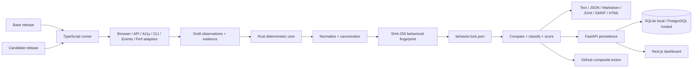

# ReleaseTruth

> Git shows what code changed. ReleaseTruth shows what your product actually changed.

[](https://github.com/PSR94/ReleaseTruth/actions/workflows/ci.yml)
[](LICENSE)
[](docs/concepts/behavior-lock.md)

ReleaseTruth is an open-source, evidence-first behavioral compatibility engine for application releases. It captures what users and integrations can actually observe, normalizes volatile noise, fingerprints the result into a versioned `behavior.lock.json`, compares releases deterministically, classifies regressions, scores compatibility, and emits CI- and human-friendly reports.

ReleaseTruth complements code diffs, API-schema diffs, visual regression tools, and contract tests. Its unit of truth is **observable runtime behavior across surfaces**. AI is optional and downstream; deterministic evidence remains the source of truth.

## What ReleaseTruth detects

| Surface | Examples of captured behavior | Flagship TruthShop regression |
| --- | --- | --- |
| API | status, selected headers, body, timing, cookies | invalid order `400 → 422` |
| Browser | journeys, visible text, DOM signals, dialogs, storage, network, focus | destructive confirmation removed |
| Accessibility | roles, names, focusability, axe violations | Pay control `button → generic` and loses keyboard focusability |
| CLI | argv execution, exit code, stdout/stderr, filesystem snapshot | receipt command exit `0 → 1` |
| Events | webhook/event sequence and stable headers | event order reversed |
| Performance | repeated timings, min/max/mean/p50/p95 | search p95 regresses beyond configured 50% threshold |

The included TruthShop demo intentionally introduces all six classes of regression so the full pipeline can prove that capture, normalization, diffing, persistence, dashboard rendering, and CI reporting work together.

## Architecture



The Rust core owns deterministic finalization and comparison. TypeScript adapters collect runtime evidence. The FastAPI service and Next.js dashboard persist and explore history without changing comparison semantics.

See [System architecture](docs/architecture/system.md) and the [architecture decisions](docs/architecture/decisions/).

## Quick start

### Prerequisites

- Rust **1.98.1** via `rustup` (the repository pins it in `rust-toolchain.toml`)
- Node.js **20+**; CI uses Node 22
- pnpm **9.15.4** via Corepack or pnpm
- Python **3.12+** for the API/platform
- Chromium for browser capture
- Docker + Docker Compose for the full self-hosted stack/release check

Install repository dependencies and Chromium:

```bash
make setup
```

### Run the complete behavioral demo

```bash
make demo
```

This builds ReleaseTruth and TruthShop, starts a good release on `127.0.0.1:3000` and a regression release on `127.0.0.1:3001`, captures all six surfaces, replays the base draft to prove deterministic finalization, records local history, sets the base baseline, and writes reports under:

```text
.releasetruth/demo/
├── base/behavior.lock.json
├── base-replay/behavior.lock.json
├── candidate/behavior.lock.json
├── report.json
├── report.md
├── report.junit.xml
├── report.sarif
└── report.html
```

Open `.releasetruth/demo/report.html` for the standalone report.

### Run the full platform E2E

```bash
make e2e
```

The E2E starts the API, runs the six-surface TruthShop capture and comparison, persists the run, starts the dashboard, verifies the persisted changes, verifies the rendered comparison page, and captures real dashboard screenshots into `.releasetruth/e2e/`.

For the full release gate—including format/lint/test/build/container/E2E checks—run:

```bash
make release-check
```

## CLI

Build or install the Rust CLI from source:

```bash
cargo build --locked --release -p releasetruth
# or
cargo install --locked --path crates/cli
```

Initialize a project and validate configuration:

```bash
releasetruth init
releasetruth doctor
```

Finalize adapter-produced drafts into immutable behavioral contracts:

```bash
releasetruth capture \
  --input .releasetruth/base/draft.behavior.lock.json \
  --output .releasetruth/base \
  --record-history \
  --git-sha "$(git rev-parse HEAD)"
```

Compare two releases:

```bash
releasetruth compare \
  .releasetruth/base/behavior.lock.json \
  .releasetruth/candidate/behavior.lock.json \
  --format text \
  --fail-on breaking
```

Other deterministic lifecycle commands:

```bash
releasetruth fingerprint .releasetruth/base/behavior.lock.json --verify
releasetruth baseline .releasetruth/base/behavior.lock.json
releasetruth baseline
releasetruth history --limit 20
releasetruth blame .releasetruth/base/behavior.lock.json chg-...
releasetruth bisect .releasetruth/base/behavior.lock.json --fail-on breaking
```

`baseline`, `history`, `blame`, and `bisect` use local provenance in `.releasetruth/` and verify stored fingerprints before trusting recorded snapshots.

Full command reference: [CLI quick start](docs/getting-started/cli.md).

## `behavior.lock.json`

`behavior.lock.json` is the versioned behavioral contract. v1 uses the discriminator:

```json
{
  "schema": "releasetruth.behavior/v1",
  "release": "v1-good",
  "capturedAt": "2026-09-09T20:00:00Z",
  "surfaces": {
    "api": [],
    "browser": [],
    "accessibility": [],
    "cli": [],
    "events": [],
    "performance": []
  },
  "evidence": [],
  "fingerprint": "sha256:..."
}
```

The fingerprint covers the schema, normalized surfaces, and normalization manifest. Volatile release labels, capture timestamps, source metadata, evidence storage paths, and the fingerprint field itself are excluded. Observation ordering is canonicalized, object keys are recursively sorted, and arrays retain order unless configuration explicitly declares them unordered.

See the [behavior lock specification](docs/concepts/behavior-lock.md) and JSON schemas under [`schemas/behavior/v1/`](schemas/behavior/v1/).

## Configuration

`releasetruth init` creates `.releasetruth.yml`. The demo configuration shows all current sections:

```yaml
normalization:
  defaults: true
  rules: []

classification:
  performanceRegressionPercent: 50
  expectedChangeIds: []
  severityOverrides: {}

scoring:
  penalties:
    expected: 0
    minor: 1
    significant: 7
    breaking: 20
  surfaceWeights:
    api: 1
    accessibility: 1.25
    browser: 1
    cli: 1
    events: 0.75
    performance: 0.5
```

Adapter journeys/scenarios are also configured in YAML. See [`.releasetruth.demo.yml`](.releasetruth.demo.yml) for a complete runnable example.

## Reports and exit codes

`releasetruth compare` supports:

- `text` — terminal summary
- `json` — machine-readable comparison and score
- `markdown` — PR/CI summary
- `junit` — test-report integration
- `sarif` — code-scanning compatible output
- `html` — standalone evidence report

Exit codes are intentionally CI-friendly:

| Code | Meaning |
| ---: | --- |
| `0` | comparison accepted / no change reaches the configured gate |
| `1` | operational, configuration, schema, or fingerprint error |
| `2` | a change reached `--fail-on` (`breaking` by default) |

Use `--fail-on never` when you only want to render reports.

## GitHub Actions

This repository ships a composite action at `action.yml`:

```yaml
steps:
  - uses: actions/checkout@v7
  - name: Compare release behavior
    uses: PSR94/ReleaseTruth@main
    with:
      base-lock: artifacts/base/behavior.lock.json
      candidate-lock: artifacts/candidate/behavior.lock.json
      config: .releasetruth.yml
      fail-on: breaking
      report-dir: .releasetruth/action
```

It renders JSON, Markdown, and SARIF, appends Markdown to the GitHub step summary, exposes report paths as outputs, and enforces the requested compatibility threshold. CI smoke-tests the action against the repository itself.

Use an immutable ReleaseTruth tag or commit SHA in production once you select a released version. See [GitHub Actions integration](docs/integrations/github-actions.md).

## API and dashboard

The FastAPI service persists projects, snapshots, comparisons, changes, baselines, and GitHub deliveries. SQLite is the zero-setup local mode; PostgreSQL is the supported composed/hosted database and is managed with Alembic migrations.

Key endpoints:

```text
GET  /health
POST /v1/projects
GET  /v1/projects
POST /v1/snapshots
POST /v1/runs/ingest
GET  /v1/runs
GET  /v1/runs/{run_id}
GET  /v1/projects/{project_id}/history
GET  /v1/projects/{project_id}/snapshots
GET  /v1/projects/{project_id}/baseline
PUT  /v1/projects/{project_id}/baseline
GET  /v1/summary
POST /v1/github/webhook
```

The dashboard shows global compatibility metrics, project timelines, current baseline context, run-level score/status, and an interactive change explorer with surface, severity, and text filters plus before/after evidence.

API reference: [docs/api.md](docs/api.md).

## Self-hosting

Start the full stack:

```bash
docker compose up --build
```

| Service | URL |
| --- | --- |
| ReleaseTruth API | `http://localhost:8000` |
| Dashboard | `http://localhost:3002` |
| TruthShop good release | `http://localhost:3000` |
| TruthShop regression release | `http://localhost:3001` |
| PostgreSQL | internal Compose service `postgres:5432` |

The API container runs `alembic upgrade head` before Uvicorn starts. Service healthchecks ensure the dashboard waits for the API and the API waits for PostgreSQL.

See [Self-hosting](docs/deployment/self-hosting.md) and [`.env.example`](.env.example).

## Determinism and trust model

ReleaseTruth is designed so the same normalized behavior produces the same fingerprint and diff without model inference:

- UUIDs, timestamps, localhost ports, and temporary paths have conservative default normalization.
- Explicit rules can remove/replace/regex-normalize values or sort arrays that are semantically unordered.
- Ordered arrays stay ordered by default because order is often observable behavior.
- API credentials/cookies and password-like values are redacted before persistence where adapters know those fields are sensitive.
- CLI execution uses executable + argv with `shell: false` by default, a temporary working directory, and timeouts.
- GitHub webhook ingestion is disabled by default. When enabled in production it requires an HMAC secret; unsigned mode is an explicitly named development-only escape hatch.
- ReleaseTruth does not safely sandbox hostile binaries or hostile capture configurations. Run untrusted scenarios only inside isolation you control.

See [Security policy](SECURITY.md) and [Trust model](docs/security/trust-model.md).

## Validation matrix

Every `main` push and pull request runs:

- Rust 1.98.1 format, Clippy with `-D warnings`, and workspace tests
- TypeScript typechecks, adapter/dashboard tests, and Next.js/package builds
- FastAPI Ruff + pytest checks
- PostgreSQL Alembic migration smoke test
- Docker image builds for API, dashboard, and both TruthShop variants
- composite GitHub Action smoke test
- full behavioral capture → persistence → dashboard E2E
- E2E evidence upload, including generated behavior locks, reports, logs, and dashboard screenshots

Tag pushes matching `v*` run the full validation again before producing Linux, macOS, and Windows CLI archives plus SHA-256 checksums in a GitHub Release.

Detailed testing guide: [docs/development/testing.md](docs/development/testing.md).

## Repository map

```text
crates/core/          deterministic model, normalization, fingerprint, diff, classification, scoring
crates/cli/           releasetruth CLI, reports, baseline/history/blame/bisect
adapters/             browser, API, accessibility, CLI, events, performance collectors
packages/runner/      YAML-driven capture orchestrator
packages/shared-types shared TypeScript behavior-lock types
apps/demo-shop/       TruthShop good/regression target
apps/api/             FastAPI persistence + Alembic migrations
apps/dashboard/       Next.js compatibility dashboard
schemas/behavior/v1/  behavior lock and change JSON schemas
scripts/              demo, ingestion, verification, release checks
.github/workflows/    CI and tag release automation
docs/                 concepts, architecture, deployment, integrations, security, research
assets/brand/         ReleaseTruth mark/wordmark usage
```

## Design principles

1. **Observable behavior over implementation intent.** Code changes are inputs; runtime evidence is the contract.
2. **Determinism before explanation.** Normalization, comparison, classification, and scoring are reproducible without AI.
3. **Evidence before severity.** Every useful diff should point back to the captured observation/artifact that caused it.
4. **Cross-surface compatibility.** A release can break users even when an OpenAPI schema or unit test suite still passes.
5. **Local-first, service-optional.** Behavior locks and CLI comparison work without the server; persistence/dashboard add history and collaboration.

## Prior art and scope

ReleaseTruth intentionally learns from API diff tools, contract testing, browser/visual regression, accessibility tooling, fuzz/schema testing, and CLI snapshot testing while focusing on the gap between them: one deterministic compatibility view across multiple observable surfaces.

See [prior-art research](docs/research/prior-art.md) and [ROADMAP.md](ROADMAP.md).

## Development

Common commands:

```bash
make setup          # dependencies + Chromium
make fmt            # Rust/TS/Python formatting
make lint           # Rust Clippy + TS + Ruff
make test           # Rust + TS + Python tests
make build          # release Rust build + TS/Next builds
make demo           # six-surface TruthShop capture/diff
make e2e            # capture -> API -> dashboard verification + screenshots
make docker-build   # build all Compose images
make release-check  # canonical local v0.1 release gate
```

Contributions are welcome. Start with [CONTRIBUTING.md](CONTRIBUTING.md), [CODE_OF_CONDUCT.md](CODE_OF_CONDUCT.md), and [SUPPORT.md](SUPPORT.md).

## Release status

The repository is versioned at **0.1.0** and contains the complete v0.1 implementation path: deterministic core, CLI, six adapters, TruthShop proof target, persistence API, dashboard, GitHub Action, Docker Compose, CI/E2E, migrations, and tag release automation. A release should only be published from a commit whose required CI and E2E gates are green; see the [v0.1.0 release checklist](docs/release/v0.1.0-checklist.md).

## License

Apache-2.0. See [LICENSE](LICENSE).
