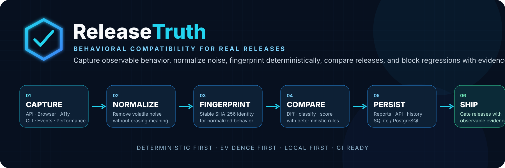
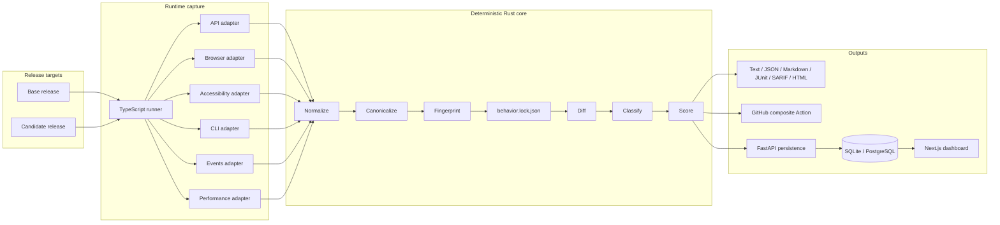
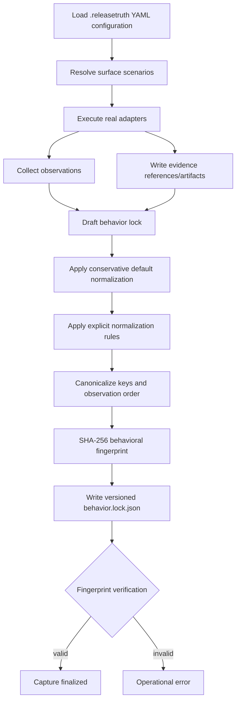
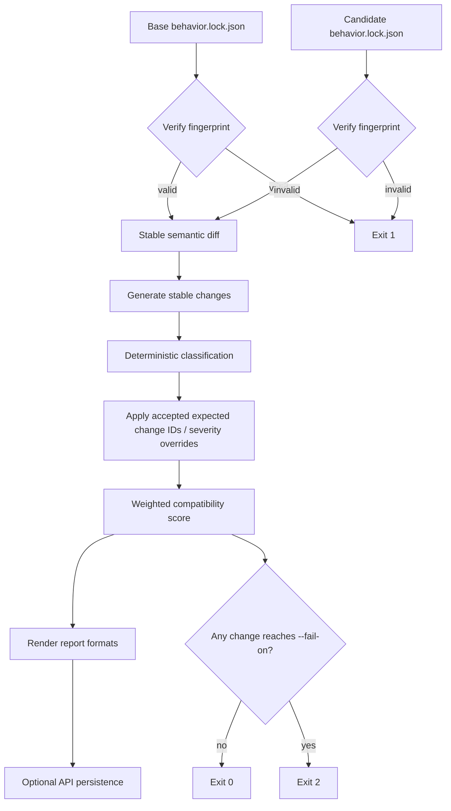
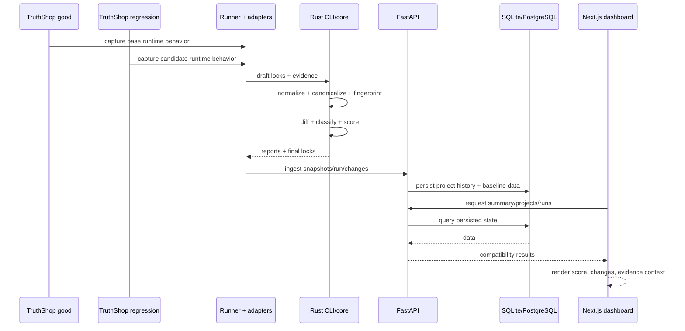
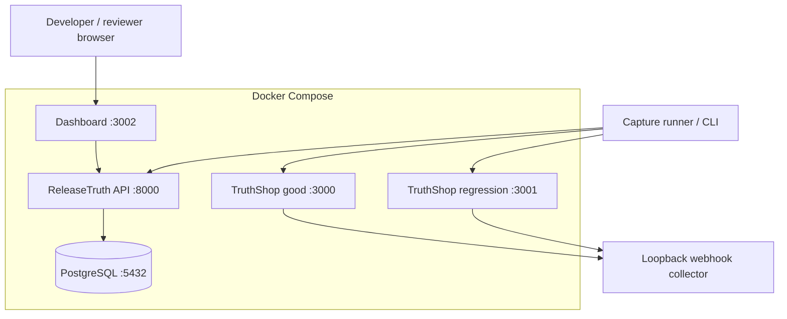
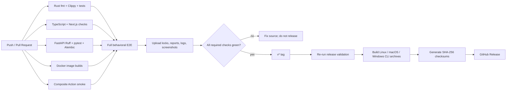

# ReleaseTruth



> **Git shows what code changed. ReleaseTruth shows what your product actually changed.**

[](https://github.com/PSR94/ReleaseTruth/actions/workflows/ci.yml)
[](LICENSE)
[](docs/concepts/behavior-lock.md)
[](crates/core)
[](adapters/browser)
[](apps/api)
[](apps/dashboard)

ReleaseTruth is an open-source, **deterministic-first, evidence-first behavioral compatibility engine** for application releases. It captures what users and integrations can actually observe, normalizes volatile noise, fingerprints that behavior into a versioned `behavior.lock.json`, compares releases deterministically, classifies regressions, calculates a compatibility score, and emits both human- and CI-friendly evidence.

ReleaseTruth complements source diffs, API-schema diffs, unit/integration tests, accessibility checks, browser automation, CLI snapshots, and performance tests. Its unit of truth is **observable runtime behavior across surfaces**. AI may be added later for explanation, but it is deliberately downstream of deterministic evidence and must never decide the compatibility verdict.

---

## Table of contents

- [Project handoff — start here next time](#project-handoff--start-here-next-time)
- [TODO / pending work](#todo--pending-work)
- [What ReleaseTruth detects](#what-releasetruth-detects)
- [Architecture and flow charts](#architecture-and-flow-charts)
  - [System architecture](#system-architecture)
  - [Capture and finalization flow](#capture-and-finalization-flow)
  - [Comparison and release-gating flow](#comparison-and-release-gating-flow)
  - [Persistence and dashboard flow](#persistence-and-dashboard-flow)
  - [Self-hosted deployment topology](#self-hosted-deployment-topology)
  - [CI and release flow](#ci-and-release-flow)
- [Quick start](#quick-start)
- [CLI](#cli)
- [`behavior.lock.json`](#behaviorlockjson)
- [Configuration](#configuration)
- [Reports and exit codes](#reports-and-exit-codes)
- [GitHub Actions](#github-actions)
- [API and dashboard](#api-and-dashboard)
- [Self-hosting](#self-hosting)
- [Determinism and trust model](#determinism-and-trust-model)
- [Validation matrix](#validation-matrix)
- [Repository map](#repository-map)
- [Documentation index](#documentation-index)
- [Design principles](#design-principles)
- [Prior art and scope](#prior-art-and-scope)
- [Development commands](#development-commands)
- [Release status](#release-status)
- [License](#license)

---

# Project handoff — start here next time

**Handoff date:** September 9, 2026 (America/New_York)  
**Repository:** `PSR94/ReleaseTruth`  
**Default branch:** `main`  
**Last fully validated implementation commit:** `480bbc638c2e0f6e576d6b47a6cf3303a0d241f4`  
**Authoritative implementation validation:** GitHub Actions CI run **#47** completed successfully on that commit.  
**Current product version in source:** `0.1.0`  
**Published GitHub Release:** **none yet**  
**Known non-main branch:** `dependabot/cargo/sha2-0.11`  
**Known open PR:** **#2 — `chore(deps): bump sha2 from 0.10.9 to 0.11.0`**

> This README is the project handoff document. In a new session, read this section and the TODO section first. Do **not** re-audit the whole repository unless current CI, a dependency change, or a specific bug gives a reason.

## Current status in one sentence

The **v0.1 implementation path is complete and end-to-end validated**: deterministic Rust core, CLI, all six capture adapters, TruthShop good/regression targets, report generation, FastAPI persistence, SQLite/PostgreSQL support, Alembic migrations, Next.js dashboard, Docker Compose, composite GitHub Action, full CI, and capture-to-dashboard E2E. **Public release publication and later platform hardening remain pending.**

## What has been completed

- deterministic `behavior.lock` v1 model and JSON schemas;
- conservative normalization of known volatile values;
- recursive canonicalization and stable observation ordering;
- SHA-256 behavioral fingerprinting;
- stable diff/change IDs;
- deterministic classification and severity overrides;
- expected-change acceptance handling;
- weighted compatibility scoring;
- explicit schema migration boundary;
- Rust CLI commands: `init`, `doctor`, `capture`, `compare`, `fingerprint`, `baseline`, `history`, `blame`, and `bisect`;
- text, JSON, Markdown, JUnit, SARIF, and HTML reports;
- TypeScript capture runner driven by YAML;
- real API adapter;
- real browser/Playwright adapter;
- real accessibility adapter with semantic capture + axe evidence;
- real CLI process/filesystem adapter;
- real events/webhook collector;
- real performance sampler with p50/p95 summaries;
- TruthShop good/regression variants with intentional cross-surface regressions;
- deterministic replay verification for equivalent normalized input;
- FastAPI project/snapshot/run/change/baseline persistence;
- SQLite zero-setup local mode;
- PostgreSQL deployment mode;
- Alembic migrations and migration smoke tests;
- hardened GitHub webhook HMAC handling and delivery idempotency;
- Next.js dashboard with project history, baseline context, score/status, and change filtering;
- correct handling of a legitimate `0.0` compatibility average through API and dashboard;
- Dockerfiles and Docker Compose stack;
- composite GitHub Action and Action smoke test;
- CI matrix for Rust, TypeScript/Next.js, Python, migrations, containers, Action smoke, and full behavioral E2E;
- Playwright Chromium installation from the correct workspace;
- E2E evidence artifact including hidden `.releasetruth` content;
- real dashboard screenshot capture as CI evidence;
- cross-platform tag workflow for Linux/macOS/Windows CLI archives and SHA-256 checksums;
- architecture, CLI, API, deployment, GitHub Actions, testing, security/trust-model, prior-art, release-checklist, changelog, roadmap, and branding documentation;
- this root README as the durable project continuation/handoff document;
- a real repository banner SVG at `assets/brand/banner.svg`.

## Last validated end-to-end behavior

The validated implementation proves this full path:

```text
TruthShop good + regression releases
        ↓
TypeScript runner + six real adapters
        ↓
raw observations + evidence
        ↓
Rust normalization + canonicalization
        ↓
behavior.lock.json + SHA-256 fingerprint
        ↓
deterministic diff + classification + scoring
        ↓
text / JSON / Markdown / JUnit / SARIF / HTML reports
        ↓
FastAPI persistence
        ↓
SQLite or PostgreSQL
        ↓
Next.js dashboard
        ↓
real screenshots + CI evidence artifact
```

The E2E specifically asserts these intended TruthShop regressions:

| Surface | Regression | Classification |
| --- | --- | --- |
| API | invalid order status `400 → 422` | breaking |
| Browser | destructive checkout confirmation dialog removed | breaking |
| Accessibility | Pay control role `button → generic` | breaking |
| Accessibility | Pay control loses keyboard focusability | breaking |
| CLI | receipt command exit `0 → 1` | breaking |
| Events | checkout webhook ordering reversed | significant |
| Performance | search p95 exceeds configured 50% regression threshold | significant |

The E2E also verifies real observations on **all six surfaces**, non-empty report formats, deterministic replay fingerprint equality, API persistence, representative dashboard changes, persisted global score values, and generated dashboard screenshots.

## Start the next session like this

```text
@GitHub Open PSR94/ReleaseTruth. Read only the root README Project handoff and TODO sections first. Continue from the highest-priority unchecked TODO item. Do not re-audit completed subsystems unless the latest CI, the Dependabot PR, or a concrete failure requires it.
```

---

# TODO / pending work

This is the authoritative continuation list as of **September 9, 2026**. These items are intentionally **not** claimed as completed.

## P0 — finish v0.1 release/publication

- [ ] Confirm CI is green on the final documentation/banner HEAD before tagging.
- [ ] Review Dependabot PR #2 (`sha2 0.10.9 → 0.11.0`): merge only if compatibility and full CI are green, otherwise defer/close it deliberately.
- [ ] If PR #2 is merged, rerun the complete required CI/E2E matrix and use only that new green commit for release.
- [ ] Configure appropriate `main` branch protection/rulesets and required checks.
- [ ] Publish the first `v0.1.0` GitHub Release only from an exact fully green HEAD.
- [ ] Validate the actual `v0.1.0` tag workflow and confirm Linux, macOS, and Windows CLI archives.
- [ ] Verify generated SHA-256 checksums for release archives.
- [ ] Confirm release notes and `CHANGELOG.md` match the tagged code and do not describe roadmap-only functionality.
- [ ] Verify repository metadata before public launch: description, topics, homepage URL if wanted, and GitHub-recognized license metadata.
- [ ] Decide whether container images should be published to a registry.
- [ ] Decide whether the Rust CLI should also be published to crates.io.
- [ ] Decide whether JavaScript packages should be published to a registry.
- [ ] Perform a final human README/link/release-artifact presentation check after tagging.

## P1 — v0.2 candidates

- [ ] Native GitHub App installation/onboarding beyond the current composite Action + webhook endpoint.
- [ ] Richer pull-request annotations and review UX.
- [ ] Remote evidence/object storage with retention controls.
- [ ] Authenticated multi-user projects and authorization boundaries.
- [ ] Production session/authentication strategy.
- [ ] Richer source/commit/deployment correlation.
- [ ] Behavioral coverage analytics.
- [ ] Adapter SDK and supported external adapter/plugin lifecycle.
- [ ] GraphQL behavioral adapter.
- [ ] gRPC behavioral adapter.
- [ ] Database behavioral adapter.
- [ ] Distributed/isolated capture workers for browser and CLI execution.
- [ ] Evidence retention/deletion policies and storage quotas.
- [ ] Production observability: structured logs, metrics, readiness details, and alerting guidance.
- [ ] API authentication/rate-limit guidance before public-internet exposure.
- [ ] PostgreSQL backup/restore operational documentation.
- [ ] Migration rollback/recovery operational documentation.
- [ ] Larger/pathological behavior-lock fixtures and migration-compatibility coverage.
- [ ] Additional browser runtime coverage such as Firefox/WebKit if product requirements justify it.
- [ ] Decide whether screenshot evidence remains evidence-only or evolves into a dedicated visual compatibility surface.

## P2 — later roadmap

- [ ] GitLab integration.
- [ ] Additional CI-provider integrations.
- [ ] Mobile/device behavioral surfaces.
- [ ] Hosted execution/control plane.
- [ ] Adapter marketplace/discovery.
- [ ] Optional AI explanation providers that remain downstream of deterministic evidence and never control the verdict.
- [ ] Hosted collaboration workflows after authentication, storage, isolation, and operational hardening are mature.

## Boundaries future work must preserve

- The deterministic engine is the verdict source; AI must not participate in fingerprints, classifications, scores, or pass/fail decisions.
- Ordered arrays stay ordered unless configuration explicitly marks them semantically unordered.
- Normalization must remove volatility without erasing meaningful behavior.
- Browser screenshots are evidence in v0.1, not a generic pixel-diff surface.
- Performance evidence is environment-sensitive and requires controlled runners/thresholds.
- CLI execution uses `shell: false` by default, but ReleaseTruth is not a security sandbox for hostile binaries.
- The API does not yet provide a complete production multi-user authentication layer.
- GitHub webhook ingestion should remain disabled by default and require a secret outside explicit development mode.
- SQLite is the local/demo path; PostgreSQL + Alembic is the intended composed/hosted path.
- `behavior.lock` v1 semantics should not be silently changed; use explicit migrations for future versions.

---

# What ReleaseTruth detects

ReleaseTruth currently captures six behavioral surfaces:

| Surface | Captured behavior examples | TruthShop proof regression |
| --- | --- | --- |
| **API** | status, selected headers, response body, cookies, timing | invalid order `400 → 422` |
| **Browser/UI** | journeys, visible text, significant DOM signals, dialogs, storage, network, console, focus, screenshots | destructive confirmation removed |
| **Accessibility** | semantic controls, role/name, focusability, axe violations | Pay control `button → generic` and loses keyboard focusability |
| **CLI** | executable/argv, exit code, stdout, stderr, filesystem snapshot | receipt command exit `0 → 1` |
| **Events/Webhooks** | received event payload metadata and stable event ordering | checkout event order reversed |
| **Performance** | repeated timing samples, min/max/mean/p50/p95 | search p95 exceeds configured regression threshold |

The TruthShop demo intentionally introduces cross-surface regressions so the entire pipeline proves real capture, deterministic comparison, persistence, and presentation together.

---

# Architecture and flow charts

## System architecture



## Capture and finalization flow



## Comparison and release-gating flow



## Persistence and dashboard flow



## Self-hosted deployment topology



## CI and release flow



## Component responsibilities

| Component | Location | Responsibility |
| --- | --- | --- |
| Deterministic core | `crates/core` | model, normalization, canonicalization, fingerprint, diff, classification, scoring, migrations |
| CLI | `crates/cli` | init/doctor/capture/compare/fingerprint plus baseline/history/blame/bisect |
| Runner | `packages/runner` | load YAML and orchestrate capture scenarios |
| API adapter | `adapters/api` | HTTP behavior, selected headers/body/cookies/timing/redaction |
| Browser adapter | `adapters/browser` | Playwright journeys, DOM/text/network/storage/dialog/focus/screenshot evidence |
| Accessibility adapter | `adapters/accessibility` | semantic roles/names/focusability and axe evidence |
| CLI adapter | `adapters/cli` | process exit/stdout/stderr/filesystem behavior |
| Events adapter | `adapters/events` | webhook/event collection and stable ordering |
| Performance adapter | `adapters/performance` | timing samples and min/max/mean/p50/p95 summaries |
| TruthShop | `apps/demo-shop` | good/regression proof target |
| API service | `apps/api` | persistence, history, baselines, summary, GitHub deliveries |
| Dashboard | `apps/dashboard` | compatibility exploration and change filtering |
| Schemas | `schemas/behavior/v1` | behavior-lock/change contract schemas |
| GitHub Action | `action.yml` | reusable compare/report/gate workflow |

See [System architecture](docs/architecture/system.md) and [architecture decisions](docs/architecture/decisions/).

---

# Quick start

## Prerequisites

- Rust **1.98.1** via `rustup` — pinned by `rust-toolchain.toml`;
- Node.js **20+** — CI uses Node 22;
- pnpm **9.15.4**;
- Python **3.12+**;
- Chromium for browser capture;
- Docker + Docker Compose for full-stack/self-hosted validation.

Install dependencies and Chromium:

```bash
make setup
```

## Run the complete behavioral demo

```bash
make demo
```

The demo builds ReleaseTruth and TruthShop, starts the good target on `127.0.0.1:3000` and regression target on `127.0.0.1:3001`, captures all six surfaces, re-finalizes base behavior to prove deterministic fingerprints, records local history, sets the base baseline, and writes:

```text
.releasetruth/demo/
├── base/behavior.lock.json
├── base-replay/behavior.lock.json
├── candidate/behavior.lock.json
├── report.json
├── report.md
├── report.junit.xml
├── report.sarif
└── report.html
```

Open `.releasetruth/demo/report.html` for the standalone HTML comparison report.

## Run the full platform E2E

```bash
make e2e
```

The E2E starts the API, captures and compares TruthShop, persists the run, starts the dashboard, verifies persisted changes/global score, verifies dashboard rendering, and captures real dashboard screenshots under `.releasetruth/e2e/`.

## Run the complete local release gate

```bash
make release-check
```

---

# CLI

Build or install from source:

```bash
cargo build --locked --release -p releasetruth
# or
cargo install --locked --path crates/cli
```

Initialize and validate configuration:

```bash
releasetruth init
releasetruth doctor
```

Finalize a draft capture:

```bash
releasetruth capture \
  --input .releasetruth/base/draft.behavior.lock.json \
  --output .releasetruth/base \
  --record-history \
  --git-sha "$(git rev-parse HEAD)"
```

Compare releases:

```bash
releasetruth compare \
  .releasetruth/base/behavior.lock.json \
  .releasetruth/candidate/behavior.lock.json \
  --format text \
  --fail-on breaking
```

Other lifecycle commands:

```bash
releasetruth fingerprint .releasetruth/base/behavior.lock.json --verify
releasetruth baseline .releasetruth/base/behavior.lock.json
releasetruth baseline
releasetruth history --limit 20
releasetruth blame .releasetruth/base/behavior.lock.json chg-...
releasetruth bisect .releasetruth/base/behavior.lock.json --fail-on breaking
```

`baseline`, `history`, `blame`, and `bisect` use local provenance under `.releasetruth/` and verify stored fingerprints before trusting historical snapshots.

Full CLI guide: [docs/getting-started/cli.md](docs/getting-started/cli.md).

---

# `behavior.lock.json`

`behavior.lock.json` is the versioned behavioral contract. v1 uses:

```json
{
  "schema": "releasetruth.behavior/v1",
  "release": "v1-good",
  "capturedAt": "2026-09-09T20:00:00Z",
  "surfaces": {
    "api": [],
    "browser": [],
    "accessibility": [],
    "cli": [],
    "events": [],
    "performance": []
  },
  "evidence": [],
  "fingerprint": "sha256:..."
}
```

The fingerprint covers schema + normalized surfaces + normalization manifest. Volatile release labels, capture timestamps, source metadata, evidence paths, and the fingerprint field itself are excluded. Object keys are recursively sorted; observations are canonicalized; arrays retain order unless configuration explicitly declares them unordered.

A behavior lock is intended to be reviewable and versionable like a dependency lockfile, except it represents **observable runtime behavior**, not package resolution.

See [behavior-lock concepts](docs/concepts/behavior-lock.md) and [`schemas/behavior/v1/`](schemas/behavior/v1/).

---

# Configuration

`releasetruth init` creates `.releasetruth.yml`. Current core concepts include:

```yaml
normalization:
  defaults: true
  rules: []

classification:
  performanceRegressionPercent: 50
  expectedChangeIds: []
  severityOverrides: {}

scoring:
  penalties:
    expected: 0
    minor: 1
    significant: 7
    breaking: 20
  surfaceWeights:
    api: 1
    accessibility: 1.25
    browser: 1
    cli: 1
    events: 0.75
    performance: 0.5
```

Adapter journeys/scenarios are configured in YAML as well. See [`.releasetruth.demo.yml`](.releasetruth.demo.yml) for the complete runnable example.

---

# Reports and exit codes

`releasetruth compare` supports:

| Format | Intended use |
| --- | --- |
| `text` | terminal summary |
| `json` | machine-readable automation |
| `markdown` | PR/CI summaries |
| `junit` | test-report systems |
| `sarif` | code-scanning compatible tooling |
| `html` | standalone human evidence report |

Exit semantics:

| Code | Meaning |
| ---: | --- |
| `0` | comparison accepted; no change reaches the configured gate |
| `1` | operational/configuration/schema/fingerprint failure |
| `2` | a change reaches `--fail-on` |

Use `--fail-on never` to render reports without gating.

---

# GitHub Actions

The repository ships a composite action at `action.yml`:

```yaml
steps:
  - uses: actions/checkout@v7

  - name: Compare release behavior
    uses: PSR94/ReleaseTruth@main
    with:
      base-lock: artifacts/base/behavior.lock.json
      candidate-lock: artifacts/candidate/behavior.lock.json
      config: .releasetruth.yml
      fail-on: breaking
      report-dir: .releasetruth/action
```

It renders JSON, Markdown, and SARIF; appends Markdown to the GitHub step summary; exposes report paths as outputs; and enforces the requested severity threshold. The repository CI smoke-tests this composite Action.

**Production guidance:** once `v0.1.0` is published, pin the action to an immutable release tag or commit SHA rather than `main`.

See [GitHub Actions integration](docs/integrations/github-actions.md).

---

# API and dashboard

The FastAPI service persists projects, snapshots, comparison runs, changes, baselines, and GitHub delivery IDs. SQLite is the zero-setup local path; PostgreSQL is the composed/hosted path and is managed through Alembic.

Key endpoints:

```text
GET  /health
POST /v1/projects
GET  /v1/projects
GET  /v1/projects/{project_id}
POST /v1/snapshots
GET  /v1/projects/{project_id}/snapshots
POST /v1/runs/ingest
GET  /v1/runs
GET  /v1/runs/{run_id}
GET  /v1/projects/{project_id}/history
GET  /v1/projects/{project_id}/baseline
PUT  /v1/projects/{project_id}/baseline
GET  /v1/summary
POST /v1/github/webhook
```

The dashboard presents:

- global project/capture/comparison/change counts;
- average compatibility score, including valid `0/100` values;
- tracked projects;
- recent comparisons;
- project timelines;
- current baseline relationship;
- run-level score/status;
- change filters by surface, severity, and free-text context;
- before/after values and evidence references.

API guide: [docs/api.md](docs/api.md).

---

# Self-hosting

Start the stack:

```bash
docker compose up --build
```

| Service | Address |
| --- | --- |
| ReleaseTruth API | `http://localhost:8000` |
| Dashboard | `http://localhost:3002` |
| TruthShop good | `http://localhost:3000` |
| TruthShop regression | `http://localhost:3001` |
| PostgreSQL | Compose service `postgres:5432` |

The API container runs `alembic upgrade head` before Uvicorn starts. Compose health checks coordinate PostgreSQL → API → dashboard readiness.

See [Self-hosting](docs/deployment/self-hosting.md) and [`.env.example`](.env.example).

---

# Determinism and trust model

ReleaseTruth is designed so equivalent normalized behavior produces the same fingerprint and deterministic diff without model inference.

- UUIDs, timestamps, localhost ports, and temporary paths have conservative defaults.
- Explicit rules can remove/replace/regex-normalize values or sort arrays that are semantically unordered.
- Ordered arrays remain ordered by default because order is frequently observable behavior.
- Loopback port volatility can be normalized without pretending `localhost` and `127.0.0.1` are identical host identities.
- API credentials/cookies/password-like fields are redacted where adapters know those fields are sensitive.
- CLI execution uses executable + argv with `shell: false` by default, temporary working directories, and timeouts.
- GitHub webhook ingestion is disabled by default; production-enabled mode requires HMAC verification.
- Unsigned webhook mode is intentionally a development-only escape hatch.
- ReleaseTruth is **not** a secure sandbox for hostile binaries or hostile capture configuration.

See [SECURITY.md](SECURITY.md) and [Trust model](docs/security/trust-model.md).

---

# Validation matrix

Every `main` push and pull request is configured to run:

- Rust 1.98.1 formatting;
- Rust Clippy with `-D warnings`;
- Rust workspace tests;
- TypeScript typechecks;
- adapter/dashboard tests;
- package and Next.js builds;
- FastAPI Ruff checks;
- FastAPI pytest;
- PostgreSQL Alembic upgrade → downgrade → upgrade smoke test;
- Docker image builds for API, dashboard, and both TruthShop variants;
- composite GitHub Action smoke test;
- full behavior capture → deterministic replay → compare → persistence → dashboard E2E;
- assertions for all flagship cross-surface regressions;
- persisted API/dashboard score assertions;
- E2E evidence upload with locks, reports, logs, adapter evidence, and dashboard screenshots.

The most recent fully validated implementation checkpoint documented in this handoff is CI run **#47** on:

```text
480bbc638c2e0f6e576d6b47a6cf3303a0d241f4
```

Tag pushes matching `v*` are configured to re-run release validation before packaging Linux, macOS, and Windows CLI archives and generating SHA-256 checksums.

Detailed testing guide: [docs/development/testing.md](docs/development/testing.md).

---

# Repository map

```text
crates/core/            deterministic model, normalization, fingerprint, diff, classification, scoring
crates/cli/             releasetruth CLI and report/provenance lifecycle
adapters/api/           HTTP behavior + timing collector
adapters/browser/       Playwright browser journey collector
adapters/accessibility/ semantic + axe accessibility collector
adapters/cli/           subprocess/filesystem behavior collector
adapters/events/        webhook/event sequence collector
adapters/performance/   timing summary collector
packages/runner/        YAML-driven capture orchestrator
packages/shared-types/  shared TypeScript behavior-lock types
apps/demo-shop/         TruthShop good/regression target
apps/api/               FastAPI persistence + Alembic migrations
apps/dashboard/         Next.js compatibility dashboard
schemas/behavior/v1/    behavior-lock/change JSON schemas
scripts/                demo, ingest, verify, screenshots, release checks
.github/workflows/      CI and tag release automation
docs/                   concepts, architecture, deployment, integrations, security, testing, research, release
assets/brand/           banner, mark, wordmark and brand documentation
```

Important root files:

| File | Purpose |
| --- | --- |
| `README.md` | authoritative overview + project handoff + TODO |
| `.releasetruth.demo.yml` | complete runnable capture/classification/scoring example |
| `action.yml` | reusable composite GitHub Action |
| `docker-compose.yml` | local/self-hosted stack |
| `Makefile` | canonical development/release commands |
| `.env.example` | deployment/configuration example |
| `Cargo.toml` / `Cargo.lock` | Rust workspace + lockfile |
| `package.json` / `pnpm-lock.yaml` | TypeScript workspace + lockfile |
| `CHANGELOG.md` | shipped/unreleased change log |
| `ROADMAP.md` | future product direction; key items mirrored in the TODO above |
| `SECURITY.md` | security/vulnerability policy |
| `docs/release/v0.1.0-checklist.md` | public-release gate |

---

# Documentation index

Use this README first. Dive into these only when a task needs more detail:

| Area | Document |
| --- | --- |
| Documentation home | [docs/README.md](docs/README.md) |
| CLI | [docs/getting-started/cli.md](docs/getting-started/cli.md) |
| Behavior lock | [docs/concepts/behavior-lock.md](docs/concepts/behavior-lock.md) |
| Normalization | [docs/concepts/normalization.md](docs/concepts/normalization.md) |
| Scoring | [docs/concepts/scoring.md](docs/concepts/scoring.md) |
| System architecture | [docs/architecture/system.md](docs/architecture/system.md) |
| Architecture decisions | [docs/architecture/decisions/](docs/architecture/decisions/) |
| API | [docs/api.md](docs/api.md) |
| GitHub Actions | [docs/integrations/github-actions.md](docs/integrations/github-actions.md) |
| Self-hosting | [docs/deployment/self-hosting.md](docs/deployment/self-hosting.md) |
| Testing | [docs/development/testing.md](docs/development/testing.md) |
| Security / trust boundaries | [docs/security/trust-model.md](docs/security/trust-model.md) |
| v0.1.0 checklist | [docs/release/v0.1.0-checklist.md](docs/release/v0.1.0-checklist.md) |
| Prior art | [docs/research/prior-art.md](docs/research/prior-art.md) |
| Roadmap | [ROADMAP.md](ROADMAP.md) |
| Changelog | [CHANGELOG.md](CHANGELOG.md) |
| Contribution guide | [CONTRIBUTING.md](CONTRIBUTING.md) |
| Security policy | [SECURITY.md](SECURITY.md) |

---

# Design principles

1. **Observable behavior over implementation intent.** Source changes are inputs; runtime evidence is the contract.
2. **Determinism before explanation.** Normalization, comparison, classification, and scoring remain reproducible without AI.
3. **Evidence before severity.** Useful changes should trace back to captured observations/artifacts.
4. **Cross-surface compatibility.** A release can break users even when an API schema or unit suite looks compatible.
5. **Local-first, service-optional.** Locks and CLI comparisons work without the server; persistence/dashboard add history and collaboration.
6. **Conservative normalization.** Remove noise, not meaning.
7. **Explicit migrations.** Versioned behavioral contracts evolve through deliberate schema boundaries.
8. **Documented security boundaries.** Capture automation is not a replacement for container/process isolation.

---

# Prior art and scope

ReleaseTruth deliberately learns from API diffing, contract testing, browser/visual regression, accessibility tools, schema/fuzz testing, and CLI snapshot testing while targeting the gap between them: **one deterministic compatibility view across multiple observable runtime surfaces**.

See [prior-art research](docs/research/prior-art.md) and [ROADMAP.md](ROADMAP.md).

---

# Development commands

```bash
make setup          # dependencies + Chromium
make fmt            # Rust / TypeScript / Python formatting
make lint           # Rust Clippy + TypeScript lint + Ruff
make test           # Rust + TypeScript + Python tests
make build          # release Rust + TypeScript/Next builds
make demo           # six-surface TruthShop capture/diff
make e2e            # capture -> API -> dashboard verification + screenshots
make docker-build   # build Compose images
make release-check  # canonical local v0.1 release gate
```

Equivalent major checks:

```bash
cargo fmt --all -- --check
cargo clippy --locked --workspace --all-targets --all-features -- -D warnings
cargo test --locked --workspace
pnpm install --frozen-lockfile
pnpm check:ts
ruff check apps/api
pytest -q apps/api
docker compose build
pnpm --filter @releasetruth/browser-adapter exec playwright install chromium
./scripts/e2e.sh
```

Contributions: [CONTRIBUTING.md](CONTRIBUTING.md), [CODE_OF_CONDUCT.md](CODE_OF_CONDUCT.md), and [SUPPORT.md](SUPPORT.md).

---

# Release status

## Implemented in source v0.1.0

- deterministic core;
- complete CLI lifecycle;
- six runtime adapters;
- TruthShop good/regression proof target;
- six report formats;
- persistence API;
- SQLite local mode;
- PostgreSQL + Alembic deployment path;
- dashboard;
- GitHub composite Action;
- Docker Compose;
- CI + full E2E;
- evidence artifacts and real dashboard screenshots;
- cross-platform tag-release workflow;
- project/release/security/deployment documentation;
- README banner and architecture/flow documentation.

## Not yet published

There is **no public GitHub Release yet** at this handoff. Do not describe `v0.1.0` as publicly released until the P0 publication checklist is complete.

A release must come from an exact commit whose required CI and E2E gates are green. See [docs/release/v0.1.0-checklist.md](docs/release/v0.1.0-checklist.md).

---

# License

Apache-2.0. See [LICENSE](LICENSE).
