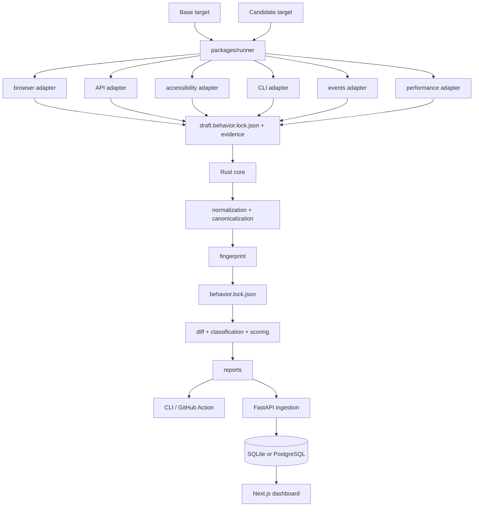

# System architecture

ReleaseTruth separates **collection** from **truth**. Runtime adapters collect evidence; the Rust core deterministically decides what normalized behavior was observed, how two releases differ, how changes are classified, and what compatibility score they produce.

## Deterministic boundary

The core crate owns:

1. versioned behavior-lock model
2. normalization rules and manifest
3. recursive canonical JSON ordering
4. observation identity sorting
5. SHA-256 behavioral fingerprinting
6. structural comparison, including stable ID-keyed arrays
7. deterministic severity classification
8. explicit expected-change acceptance
9. weighted compatibility scoring

The fingerprint excludes volatile capture metadata and evidence storage paths. This allows the same normalized behavior captured at different times or locations to remain identical.

## Collection boundary

The TypeScript runner loads YAML scenarios and invokes adapter packages. Adapters produce structured observations and evidence references; they do not decide the final fingerprint or compatibility verdict.

The six v0.1 surfaces are API, browser, accessibility, CLI, events, and performance.

## Persistence boundary

The FastAPI service stores behavior locks and comparison reports. SQLite is intended for local/zero-setup use. PostgreSQL is the composed/hosted path and schema changes are applied with Alembic.

Persistence does not recalculate compatibility. The ingested deterministic report is preserved and decomposed into queryable run/change rows for dashboard views.

## Dashboard boundary

The Next.js dashboard is a read-oriented exploration layer. It renders project timelines, baselines, run status/score and filtered change evidence. If the API is unavailable, the overview degrades to an empty summary rather than inventing state.

## CI and releases

CI validates Rust, TypeScript, Python, migrations, images, the composite Action, and the full runtime pipeline. The E2E starts real services and two TruthShop releases, captures both, verifies the six flagship regressions, persists them, renders the dashboard, and saves screenshots.

Tag workflows repeat validation before packaging the CLI. This ensures the publishing path is downstream of the same behavioral proof used during normal development.
